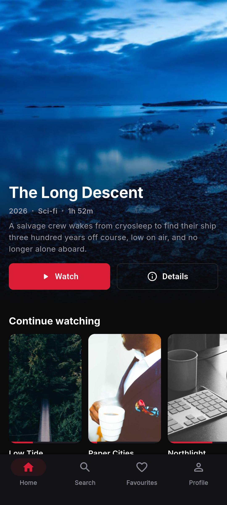
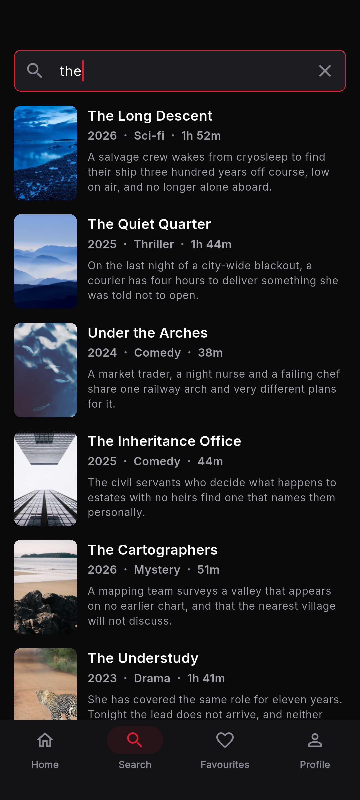
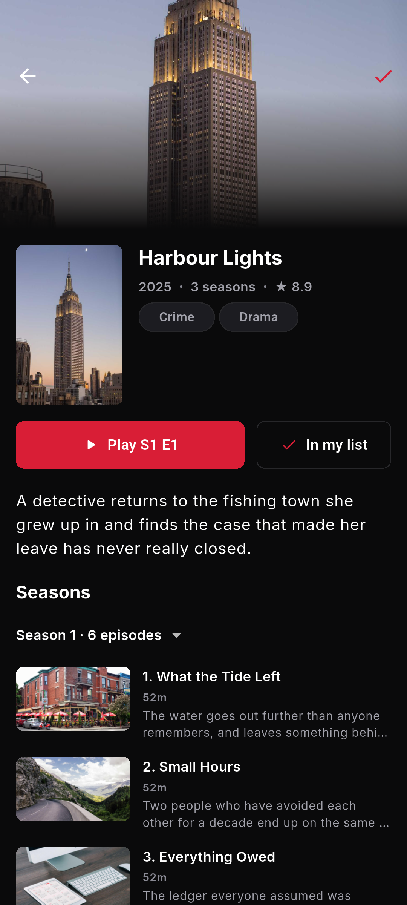
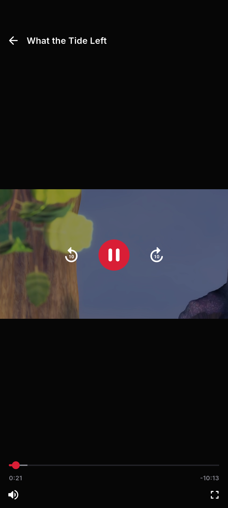
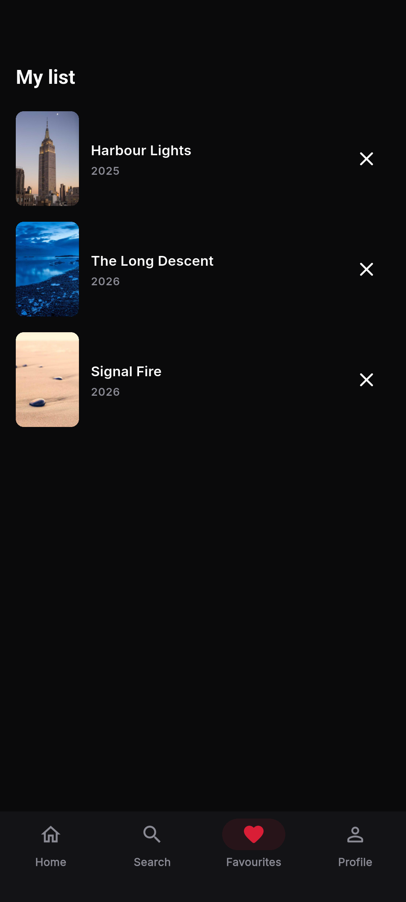

# StreamBox

A production-shaped OTT streaming client built with Flutter — browse a
catalogue, search it, inspect a title, and stream HLS with resume support.

| Home | Search | Details | Player | My list |
|:---:|:---:|:---:|:---:|:---:|
|  |  |  |  |  |

## What it is

- **Feature-first Clean Architecture** — 102 source files across `app/`, `core/` and seven features, with every third-party dependency confined to a single file it can be swapped out of.
- **Real HLS playback** behind a `PlaybackEngine` abstraction, so the video package is replaceable and the player's logic is testable without a device.
- **Offline-capable persistence** — favourites and watch history survive with no network, because each row stores the display fields it needs.
- **416 unit and widget tests plus 8 device tests**, at 91.7% line coverage of hand-written code.

## Tech stack

| Concern | Choice |
|---|---|
| State & DI | Riverpod 3.1 with code generation |
| Navigation | go_router 17.5, typed routes |
| Networking | Dio 5.11 behind an `ApiClient` |
| Models | Freezed 3.2 + json_serializable |
| Persistence | Drift 2.31 (SQLite) |
| Playback | video_player 2.14 (Media3/ExoPlayer, AVPlayer) |
| Images | cached_network_image 3.4 |

Flutter 3.44.9 · Dart 3.12.

## Quick start

```bash
flutter pub get
dart run build_runner build --delete-conflicting-outputs
flutter run
```

The catalogue is served by a deterministic in-memory source, so nothing needs
a backend. Video streams and artwork are fetched from public endpoints, so
playback needs a network connection.

```bash
flutter test                                    # 416 unit + widget tests
flutter test --coverage                         # writes coverage/lcov.info
flutter test integration_test -d <device>       # 8 end-to-end tests, needs a device
```

Screenshots regenerate with one command rather than being retaken by hand:

```bash
flutter drive --driver=test_driver/screenshot_driver.dart \
  --target=integration_test/screenshot_test.dart -d <device>
```

## Architecture

```
┌──────────────────────────────────────────────────────────────┐
│  Presentation      pages · widgets · Riverpod notifiers      │
└───────────────────────────┬──────────────────────────────────┘
                            │ depends on
┌───────────────────────────▼──────────────────────────────────┐
│  Domain            entities · contracts · use cases          │
│                    plain Dart — no Flutter, no packages      │
└───────────────────────────▲──────────────────────────────────┘
                            │ implements
┌───────────────────────────┴──────────────────────────────────┐
│  Data              models · data sources · repository impls  │
└───────────────────────────┬──────────────────────────────────┘
                            │
                 Dio · Drift · video_player
```

The domain layer imports neither Flutter nor any package — it is plain Dart,
which is what lets the whole application be tested without a device.

```
lib/
├── app/          theme tokens, typed router, shell, design gallery
├── core/         config, errors, Result, network, database, layout, widgets
└── features/
    ├── catalog/  shared bounded context: Content, ContentDetails, repository
    ├── home/     hero banner + lazy content rails
    ├── search/   debounced, paginated, sealed state union
    ├── details/  metadata, seasons, episodes, favourite toggle
    ├── player/   PlaybackEngine abstraction, controls, resume points
    ├── favorites/ · history/ · profile/
```

`catalog/` holds the shared domain and has no presentation layer of its own —
a deliberate asymmetry, because five screens are views onto one catalogue and
duplicating the entity per feature is how those drift apart.

## Engineering notes

- **Player** — `PlaybackEngine` is an interface; `video_player` appears in two
  files, the engine and the render surface. A fake engine makes lifecycle,
  retry, seek clamping and throttled progress testable with no platform channel.
- **State** — every asynchronous screen renders through one `AsyncValueView`,
  so loading, error and empty behave identically everywhere. Search is the
  deliberate exception: it uses a sealed union, because an idle prompt and
  "loading more with results still visible" are states `AsyncValue` cannot hold.
- **Persistence** — favourites and history rows carry a snapshot of the title
  they describe, so those screens render with no catalogue access at all.
- **Errors** — a sealed `AppException` is the only error currency above the
  data layer. Adding a variant is a compile error at every exhaustive `switch`,
  which is how new failure modes get real UI instead of a fallback.
- **Accessibility** — colour contrast is asserted in tests against the live
  palette, not eyeballed; three tokens failed WCAG AA when it was first added.

## Testing

| Tier | What it covers |
|---|---|
| Unit | entities, repositories, use cases, notifiers, the playback engine |
| Widget | every screen across loading, error, empty and success |
| Device | three journeys through the real app, four real HLS playback checks, one screenshot capture |

Repository tests run against **real in-memory SQLite**; screen tests use
in-memory fakes. Drift executes on the real event loop, which a widget test's
fake clock never advances, so a screen reading live SQLite would wait forever.

`integration_test/playback_test.dart` is the only test that plays real video.
Every other test substitutes a fake engine, which is precisely how a catalogue
full of dead stream URLs once passed a fully green suite.

## Limitations

- **No manual quality selection.** `video_player` exposes no track-selection
  API. Adaptive bitrate works — the platform switches on bandwidth — but there
  is no picker. `media_kit` would provide one, at the cost of bundling libmpv.
- **Drift is pinned below 2.32.** From there `drift_dev` requires a newer
  analyzer than `custom_lint` supports; static analysis across the whole
  application was judged worth more than two Drift minors.
- **The catalogue is a deterministic fake**, not a backend. Swapping in a real
  API is one provider change; nothing above the data layer references it.
- **Android-verified only.** Every build, device test and screenshot has been
  Android. iOS is configured but has not been built or run.
- **No CI yet.** Formatting, analysis and tests run locally.

## Licence

Fonts: Inter, SIL Open Font License 1.1 — see `assets/fonts/Inter-LICENSE.txt`.
Video and artwork are public test endpoints, used only for demonstration.
